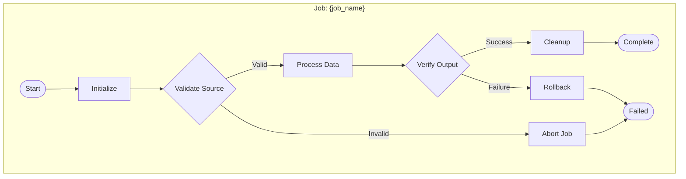

# Phase 3: Design

**Goal**: Create detailed design with data models, step configurations, and interface definitions.

**Token Budget**: ~12k tokens (this file + persistence skill + database skill)

---

## Entry Checklist

- [ ] Phase 2 complete with tech_stack confirmed
- [ ] ADRs documented
- [ ] Required skills identified

## Skill Loading

**EXECUTE NOW**: Load the required skills based on architecture decisions:

```
1. Read: .claude/sba/skills/persistence/{tech_stack.persistence}.md
2. Read: .claude/sba/skills/databases/{tech_stack.database}.md
3. Read: .claude/sba/skills/patterns/chunk-processing.md (if using chunks)
4. Read: .claude/sba/skills/patterns/fault-tolerance.md (if needed)
```

Update state: `sba_state.skills_loaded = [loaded_skill_names]`

---

## Design Activities

### 1. Data Model Design

#### Source Entity/DTO
```java
// Define based on source schema
public class {SourceName}Input {
    // Map all source fields
    // Add validation annotations
}
```

#### Target Entity/DTO
```java
// Define based on target schema
public class {TargetName}Output {
    // Map all target fields
    // Consider JPA annotations if persisting
}
```

#### Transformation Mapping
| Source Field | Transformation | Target Field |
|--------------|----------------|--------------|
| `source_field_1` | Direct map | `target_field_1` |
| `source_field_2` | Format/Convert | `target_field_2` |
| `source_field_3` + `_4` | Combine | `target_combined` |

### 2. Step Configuration Design

For each step, define:

```yaml
step_{name}:
  type: chunk|tasklet

  # If chunk:
  chunk_size: {size based on volume}
  reader:
    type: {JdbcCursorItemReader|JpaPagingItemReader|FlatFileItemReader|...}
    config: {reader-specific config}
  processor:
    type: {custom|composite|validator|...}
    logic: {transformation description}
  writer:
    type: {JdbcBatchItemWriter|JpaItemWriter|FlatFileItemWriter|...}
    config: {writer-specific config}

  # If tasklet:
  tasklet_class: {class name}
  logic: {what it does}

  # Common:
  fault_tolerance:
    skip_limit: {n}
    skip_exceptions: [...]
    retry_limit: {n}
    retry_exceptions: [...]
  listeners:
    - {StepExecutionListener}
    - {ItemReadListener}
```

### 3. Chunk Size Calculation

| Volume | DB Operations | File Operations | API Calls |
|--------|---------------|-----------------|-----------|
| Small | 100-500 | 1000-5000 | 10-50 |
| Medium | 500-1000 | 5000-10000 | 50-100 |
| Large | 1000-5000 | 10000-50000 | 100-500 |
| Enterprise | 5000-10000 | 50000+ | Async/Batch |

**Factors to consider**:
- Transaction timeout limits
- Memory constraints
- Network latency (for remote targets)
- Commit frequency requirements

### 4. Error Handling Design

```yaml
error_handling:
  strategy: {skip|retry|stop|combined}

  skip_policy:
    limit: {n}
    exceptions:
      - DataIntegrityViolationException
      - ValidationException

  retry_policy:
    limit: {n}
    backoff: {fixed|exponential}
    initial_interval: {ms}
    exceptions:
      - TransientDataAccessException
      - DeadlockLoserDataAccessException

  restart_policy:
    allow_restart: true|false
    max_restarts: {n}
```

### 5. Job Flow Design

Create detailed Mermaid diagram:



### 6. Interface Definitions

Define key interfaces:

```java
// Custom Processor Interface
public interface {Name}Processor extends ItemProcessor<Input, Output> {
    Output process(Input item) throws Exception;
}

// Custom Validator (if needed)
public interface {Name}Validator {
    ValidationResult validate(Input item);
}

// Custom Partitioner (if using partitioning)
public interface {Name}Partitioner extends Partitioner {
    Map<String, ExecutionContext> partition(int gridSize);
}
```

### 7. Configuration Properties Design

```yaml
# application.yml structure
batch:
  {job_name}:
    chunk-size: ${CHUNK_SIZE:1000}
    skip-limit: ${SKIP_LIMIT:100}
    retry-limit: ${RETRY_LIMIT:3}

    source:
      # source-specific properties

    target:
      # target-specific properties

    scheduling:
      cron: ${BATCH_CRON:0 0 2 * * ?}
      enabled: ${BATCH_ENABLED:true}
```

## Design Document Template

```markdown
## Detailed Design: {job_name}

### Data Models

#### Input Model
{class definition with annotations}

#### Output Model
{class definition with annotations}

#### Field Mapping
{mapping table}

### Job Configuration

#### Steps Overview
| Step | Type | Reader | Processor | Writer |
|------|------|--------|-----------|--------|
| step1 | chunk | {type} | {type} | {type} |

#### Step Details
{detailed config for each step}

### Error Handling
{error handling configuration}

### Job Flow
{mermaid diagram}

### Configuration Properties
{properties structure}

### Estimated Performance
- Chunk size: {n}
- Expected throughput: {records/sec}
- Estimated completion time: {for typical volume}
```

## Design Review Checklist

- [ ] All source fields mapped
- [ ] All transformations defined
- [ ] Chunk sizes appropriate for volume
- [ ] Error handling covers known failure modes
- [ ] Restart capability if needed
- [ ] Listeners for monitoring/logging identified
- [ ] Configuration externalized properly
- [ ] No hardcoded values

## Transition Criteria

**Ready for Phase 4 when:**
- [ ] Data models complete
- [ ] All steps configured
- [ ] Error handling defined
- [ ] Job flow approved
- [ ] Required skills loaded
- [ ] Design document complete
- [ ] User approves design

## Transition Command

```
sba_state.current_phase = 4
→ Read .claude/sba/phases/4-implementation.md
→ Load required templates from .claude/sba/templates/
```

---

**IMPORTANT**: Design should be detailed enough that implementation is straightforward. Resolve ambiguities now, not during coding.
