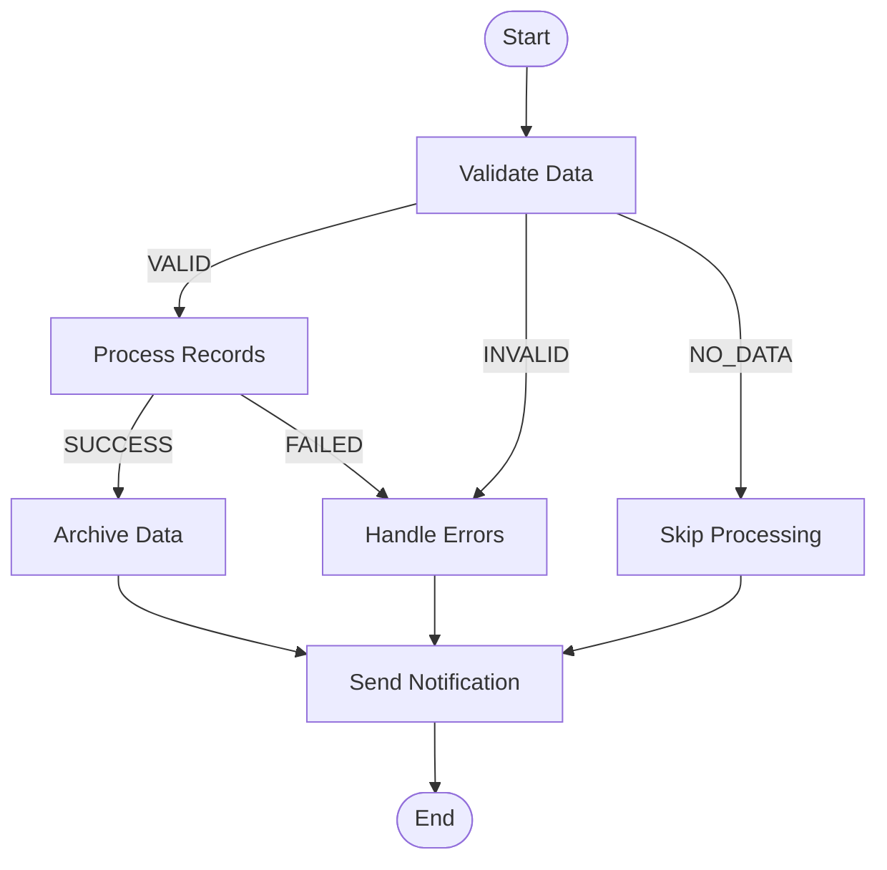

# Conditional Flow Pattern Skill

**Purpose**: Decision-based job flows with branching and conditional execution.

---

## Concept Overview

Conditional flows allow jobs to take different paths based on step outcomes:

```
                    ┌─────────────┐
                    │   Step 1    │
                    │ (Validate)  │
                    └──────┬──────┘
                           │
              ┌────────────┼────────────┐
              ▼            ▼            ▼
         [VALID]      [INVALID]     [ERROR]
              │            │            │
              ▼            ▼            ▼
        ┌─────────┐  ┌─────────┐  ┌─────────┐
        │ Process │  │  Skip   │  │  Fail   │
        └────┬────┘  └────┬────┘  └────┬────┘
             │            │            │
             └────────────┴────────────┘
                          │
                    ┌─────────┐
                    │ Cleanup │
                    └─────────┘
```

---

## Basic Conditional Flow

### Simple On/To Pattern

```java
@Bean
public Job conditionalJob(JobRepository jobRepository,
                          Step validateStep,
                          Step processStep,
                          Step errorStep) {
    return new JobBuilder("conditionalJob", jobRepository)
        .start(validateStep)
            .on("VALID").to(processStep)
        .from(validateStep)
            .on("INVALID").to(errorStep)
        .from(validateStep)
            .on("*").fail()  // Any other status fails the job
        .end()
        .build();
}
```

### Validation Step with Custom Exit Status

```java
@Component
public class ValidationTasklet implements Tasklet {

    private final JdbcTemplate jdbcTemplate;

    @Override
    public RepeatStatus execute(StepContribution contribution,
                                ChunkContext chunkContext) {

        Integer count = jdbcTemplate.queryForObject(
            "SELECT COUNT(*) FROM source_table WHERE status = 'PENDING'",
            Integer.class
        );

        if (count == null || count == 0) {
            contribution.setExitStatus(new ExitStatus("NO_DATA"));
        } else if (count > 1000000) {
            contribution.setExitStatus(new ExitStatus("LARGE_DATASET"));
        } else {
            contribution.setExitStatus(new ExitStatus("VALID"));
        }

        return RepeatStatus.FINISHED;
    }
}
```

---

## Exit Status Patterns

### Custom Exit Status from Chunk Step

```java
@Component
public class ExitStatusListener implements StepExecutionListener {

    @Override
    public ExitStatus afterStep(StepExecution stepExecution) {
        if (stepExecution.getSkipCount() > 0) {
            return new ExitStatus("COMPLETED_WITH_SKIPS")
                .addExitDescription("Skipped " + stepExecution.getSkipCount() + " items");
        }

        if (stepExecution.getWriteCount() == 0) {
            return new ExitStatus("NO_DATA");
        }

        return stepExecution.getExitStatus();
    }
}
```

### Exit Status Based on Business Logic

```java
@Component
public class BusinessValidationListener implements StepExecutionListener {

    @Override
    public ExitStatus afterStep(StepExecution stepExecution) {
        // Access step data from execution context
        long errorCount = stepExecution.getExecutionContext().getLong("errorCount", 0);
        long totalCount = stepExecution.getReadCount();

        double errorRate = (double) errorCount / totalCount;

        if (errorRate > 0.1) {
            return new ExitStatus("HIGH_ERROR_RATE");
        } else if (errorRate > 0.05) {
            return new ExitStatus("MODERATE_ERROR_RATE");
        }

        return stepExecution.getExitStatus();
    }
}
```

---

## Multi-Branch Flows

### Three-Way Branch

```java
@Bean
public Job threeBranchJob(JobRepository jobRepository,
                          Step decisionStep,
                          Step smallBatchStep,
                          Step mediumBatchStep,
                          Step largeBatchStep,
                          Step finalStep) {
    return new JobBuilder("threeBranchJob", jobRepository)
        .start(decisionStep)
            .on("SMALL").to(smallBatchStep)
        .from(decisionStep)
            .on("MEDIUM").to(mediumBatchStep)
        .from(decisionStep)
            .on("LARGE").to(largeBatchStep)
        .from(smallBatchStep)
            .on("*").to(finalStep)
        .from(mediumBatchStep)
            .on("*").to(finalStep)
        .from(largeBatchStep)
            .on("*").to(finalStep)
        .end()
        .build();
}
```

### Decision Step with Volume Check

```java
@Component
public class VolumeDecisionTasklet implements Tasklet {

    private final JdbcTemplate jdbcTemplate;

    @Override
    public RepeatStatus execute(StepContribution contribution,
                                ChunkContext chunkContext) {

        Long count = jdbcTemplate.queryForObject(
            "SELECT COUNT(*) FROM source_table WHERE status = 'PENDING'",
            Long.class
        );

        if (count < 10000) {
            contribution.setExitStatus(new ExitStatus("SMALL"));
        } else if (count < 1000000) {
            contribution.setExitStatus(new ExitStatus("MEDIUM"));
        } else {
            contribution.setExitStatus(new ExitStatus("LARGE"));
        }

        return RepeatStatus.FINISHED;
    }
}
```

---

## JobExecutionDecider

### Programmatic Decision

```java
public class DataQualityDecider implements JobExecutionDecider {

    @Override
    public FlowExecutionStatus decide(JobExecution jobExecution,
                                      StepExecution stepExecution) {

        // Access data from previous step
        long skipCount = stepExecution.getSkipCount();
        long readCount = stepExecution.getReadCount();

        if (skipCount == 0) {
            return new FlowExecutionStatus("CLEAN");
        } else if ((double) skipCount / readCount < 0.01) {
            return new FlowExecutionStatus("ACCEPTABLE");
        } else {
            return new FlowExecutionStatus("POOR_QUALITY");
        }
    }
}

@Bean
public Job deciderJob(JobRepository jobRepository,
                      Step processStep,
                      Step cleanupStep,
                      Step reviewStep,
                      Step alertStep,
                      JobExecutionDecider decider) {
    return new JobBuilder("deciderJob", jobRepository)
        .start(processStep)
        .next(decider)
            .on("CLEAN").to(cleanupStep)
        .from(decider)
            .on("ACCEPTABLE").to(reviewStep)
        .from(decider)
            .on("POOR_QUALITY").to(alertStep)
        .end()
        .build();
}
```

---

## Flow Control Patterns

### Fail on Condition

```java
@Bean
public Job failOnErrorJob(JobRepository jobRepository,
                          Step validateStep,
                          Step processStep) {
    return new JobBuilder("failOnErrorJob", jobRepository)
        .start(validateStep)
            .on("VALID").to(processStep)
        .from(validateStep)
            .on("INVALID").fail()  // Fail the job
        .end()
        .build();
}
```

### Stop on Condition

```java
@Bean
public Job stopOnConditionJob(JobRepository jobRepository,
                              Step step1,
                              Step step2) {
    return new JobBuilder("stopOnConditionJob", jobRepository)
        .start(step1)
            .on("CONTINUE").to(step2)
        .from(step1)
            .on("STOP").stopAndRestart(step1)  // Stop, allow restart from step1
        .end()
        .build();
}
```

### End with Status

```java
@Bean
public Job customEndStatusJob(JobRepository jobRepository,
                              Step step1,
                              Step step2) {
    return new JobBuilder("customEndJob", jobRepository)
        .start(step1)
            .on("*").to(step2)
        .from(step2)
            .on("NO_DATA").end("COMPLETED_NO_DATA")  // Custom final status
        .from(step2)
            .on("*").end()
        .build();
}
```

---

## Parallel Split with Conditional Join

### Split Flow

```java
@Bean
public Job parallelJob(JobRepository jobRepository,
                       Step commonStep,
                       Step branch1Step,
                       Step branch2Step,
                       Step mergeStep) {

    Flow branch1 = new FlowBuilder<SimpleFlow>("branch1")
        .start(branch1Step)
        .build();

    Flow branch2 = new FlowBuilder<SimpleFlow>("branch2")
        .start(branch2Step)
        .build();

    return new JobBuilder("parallelJob", jobRepository)
        .start(commonStep)
        .split(new SimpleAsyncTaskExecutor())
            .add(branch1, branch2)
        .next(mergeStep)  // After both branches complete
        .build();
}
```

### Conditional After Split

```java
@Bean
public Job conditionalParallelJob(JobRepository jobRepository,
                                  Step prepStep,
                                  Step branch1,
                                  Step branch2,
                                  Step successStep,
                                  Step failureStep,
                                  JobExecutionDecider parallelDecider) {

    Flow parallelFlow = new FlowBuilder<SimpleFlow>("parallelFlow")
        .split(new SimpleAsyncTaskExecutor())
        .add(
            new FlowBuilder<SimpleFlow>("b1").start(branch1).build(),
            new FlowBuilder<SimpleFlow>("b2").start(branch2).build()
        )
        .build();

    return new JobBuilder("conditionalParallelJob", jobRepository)
        .start(prepStep)
        .on("*").to(parallelFlow)
        .next(parallelDecider)
            .on("SUCCESS").to(successStep)
        .from(parallelDecider)
            .on("FAILURE").to(failureStep)
        .end()
        .build();
}
```

---

## Loop Patterns

### Retry Loop with Decider

```java
public class RetryDecider implements JobExecutionDecider {

    private final AtomicInteger attempts = new AtomicInteger(0);
    private final int maxAttempts;

    @Override
    public FlowExecutionStatus decide(JobExecution jobExecution,
                                      StepExecution stepExecution) {

        if (stepExecution.getStatus() == BatchStatus.COMPLETED) {
            return new FlowExecutionStatus("DONE");
        }

        if (attempts.incrementAndGet() < maxAttempts) {
            return new FlowExecutionStatus("RETRY");
        }

        return new FlowExecutionStatus("EXHAUSTED");
    }
}

@Bean
public Job retryLoopJob(JobRepository jobRepository,
                        Step attemptStep,
                        Step waitStep,
                        Step successStep,
                        Step failureStep,
                        RetryDecider retryDecider) {
    return new JobBuilder("retryLoopJob", jobRepository)
        .start(attemptStep)
        .next(retryDecider)
            .on("DONE").to(successStep)
        .from(retryDecider)
            .on("RETRY").to(waitStep).next(attemptStep)  // Loop back
        .from(retryDecider)
            .on("EXHAUSTED").to(failureStep)
        .end()
        .build();
}
```

---

## Error Handling Flows

### Global Error Handler

```java
@Bean
public Job errorHandlingJob(JobRepository jobRepository,
                            Step step1,
                            Step step2,
                            Step errorHandler) {

    Flow mainFlow = new FlowBuilder<SimpleFlow>("mainFlow")
        .start(step1)
        .next(step2)
        .build();

    return new JobBuilder("errorHandlingJob", jobRepository)
        .start(mainFlow)
            .on("FAILED").to(errorHandler)
        .from(mainFlow)
            .on("*").end()
        .end()
        .build();
}
```

### Step-Specific Error Handling

```java
@Bean
public Job stepErrorJob(JobRepository jobRepository,
                        Step criticalStep,
                        Step normalStep,
                        Step criticalErrorHandler,
                        Step notificationStep) {
    return new JobBuilder("stepErrorJob", jobRepository)
        .start(criticalStep)
            .on("FAILED").to(criticalErrorHandler)
                .next(notificationStep)
        .from(criticalStep)
            .on("*").to(normalStep)
                .on("*").to(notificationStep)
        .end()
        .build();
}
```

---

## State Passing Between Branches

### Using Job Execution Context

```java
@Component
public class ContextSharingListener implements StepExecutionListener {

    @Override
    public ExitStatus afterStep(StepExecution stepExecution) {
        // Store results in job context for conditional decisions
        JobExecution jobExecution = stepExecution.getJobExecution();

        jobExecution.getExecutionContext().putLong(
            "recordsProcessed",
            stepExecution.getWriteCount()
        );

        jobExecution.getExecutionContext().putString(
            "lastStepStatus",
            stepExecution.getStatus().name()
        );

        return stepExecution.getExitStatus();
    }
}

// In Decider
public class ContextAwareDecider implements JobExecutionDecider {

    @Override
    public FlowExecutionStatus decide(JobExecution jobExecution,
                                      StepExecution stepExecution) {

        long processed = jobExecution.getExecutionContext()
            .getLong("recordsProcessed", 0);

        if (processed > 1000) {
            return new FlowExecutionStatus("HIGH_VOLUME");
        }
        return new FlowExecutionStatus("NORMAL");
    }
}
```

---

## Visualization of Flow

### Mermaid Diagram Template



---

## Best Practices

1. **Clear Exit Status Names**: Use descriptive, business-meaningful names
2. **Default Handling**: Always handle `*` (wildcard) case
3. **Document Flow**: Create diagrams for complex flows
4. **Test All Paths**: Unit test each conditional branch
5. **Avoid Deep Nesting**: Keep flow logic readable
6. **Use Deciders for Complex Logic**: Better than multiple listeners
