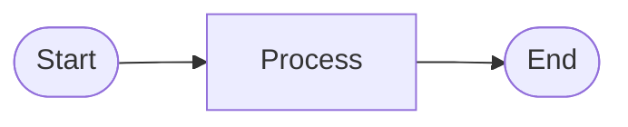
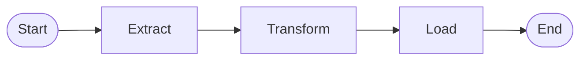
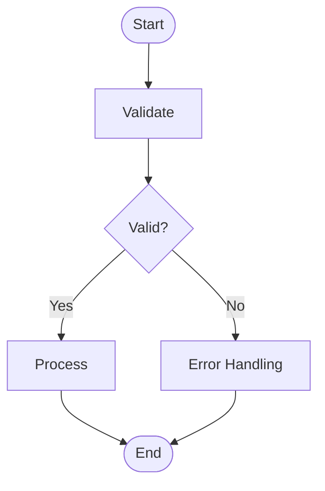
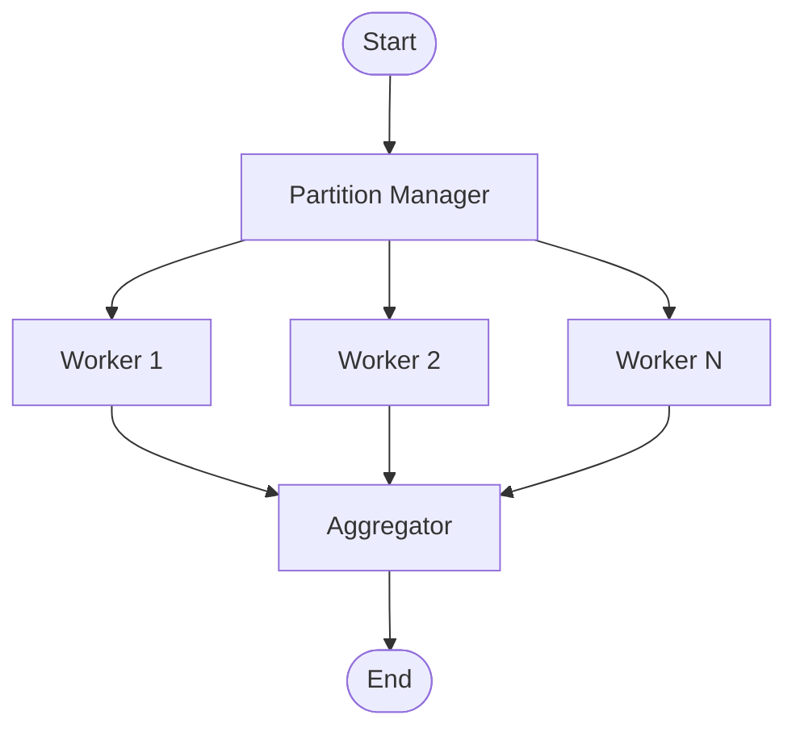

# Phase 2: Architecture

**Goal**: Make high-level architecture decisions and document them as ADRs.

**Token Budget**: ~8k tokens (this file + 2-3 pattern skills if needed)

---

## Entry Checklist

- [ ] Phase 1 complete with populated project_context
- [ ] Sources and targets defined
- [ ] Volume classification known

## Architecture Decisions to Make

### Decision 1: Processing Pattern

Based on requirements, recommend:

| Scenario | Pattern | Rationale |
|----------|---------|-----------|
| Simple record-by-record processing | **Chunk Processing** | Standard, efficient for CRUD operations |
| Complex logic per record | **Chunk Processing** | ItemProcessor handles complexity |
| Non-record-based work | **Tasklet** | File operations, cleanup, API calls |
| Mixed workloads | **Hybrid** | Tasklets + Chunk steps combined |

**Volume-Based Recommendations**:
- **Small/Medium**: Simple chunk processing
- **Large**: Chunk + multi-threading or partitioning
- **Enterprise**: Partitioning + remote chunking

### Decision 2: Persistence Layer

| Scenario | Choice | Rationale |
|----------|--------|-----------|
| Complex domain model | **JPA** | ORM benefits, entity relationships |
| Performance-critical | **MyBatis** | Fine-grained SQL control |
| Simple CRUD | **JPA** | Less boilerplate |
| Legacy DB / stored procs | **MyBatis** | Better stored proc support |
| Maximum performance | **JDBC** | Lowest overhead |

### Decision 3: Parallelization Strategy

| Volume | Strategy | Implementation |
|--------|----------|----------------|
| Small | None | Single-threaded |
| Medium | Multi-threaded Step | `taskExecutor` on step |
| Large | Partitioning | `Partitioner` + worker steps |
| Enterprise | Remote Chunking | Distributed workers |

### Decision 4: Fault Tolerance

| Requirement | Pattern |
|-------------|---------|
| Skip bad records | `SkipPolicy` |
| Retry transient failures | `RetryPolicy` |
| Resume from failure | `JobRepository` + restart |
| All above | Combined fault tolerance |

### Decision 5: Job Structure

**Single Step** (Simple cases):


**Multi-Step Sequential**:


**Conditional Flow**:


**Parallel Partitioned**:


## ADR Template

Document each decision:

```markdown
### ADR-{NNN}: {Title}

**Status**: Accepted

**Context**:
{Why this decision is needed}

**Decision**:
{What we decided}

**Consequences**:
- {Positive consequence 1}
- {Trade-off or negative 1}

**Alternatives Considered**:
- {Alternative 1}: {Why rejected}
```

## Technology Stack Confirmation

After decisions, confirm tech stack:

```yaml
tech_stack:
  persistence: "{jpa|mybatis|jdbc}"
  database: "{oracle|postgresql|mysql|sqlserver}"
  spring_boot: "3.2"
  java_version: "17"
  additional_deps:
    - "spring-batch-integration"  # if messaging needed
    - "spring-retry"              # if retry needed
```

## Skill Loading Decision

Based on decisions, determine which skills to load in Phase 3:

```yaml
skills_to_load:
  persistence: "{jpa|mybatis}"   # Based on Decision 2
  database: "{oracle|postgresql}" # Based on target DB
  patterns:
    - "chunk-processing"          # Almost always
    - "fault-tolerance"           # If error handling needed
    - "partitioning"              # If large/enterprise volume
```

## Architecture Summary Template

Present to user:

```markdown
## Architecture Decisions

### Processing Approach
- **Pattern**: {Chunk Processing / Tasklet / Hybrid}
- **Parallelization**: {None / Multi-threaded / Partitioned / Remote}
- **Fault Tolerance**: {Skip / Retry / Restart / Combined}

### Technology Stack
| Component | Choice | Rationale |
|-----------|--------|-----------|
| Persistence | {JPA/MyBatis/JDBC} | {reason} |
| Database | {Oracle/PostgreSQL/...} | {reason} |
| Spring Boot | 3.2 | Latest stable |
| Java | 17 | LTS version |

### Job Structure
{Mermaid diagram of job flow}

### ADRs Created
1. ADR-001: {title}
2. ADR-002: {title}
...

### Next Steps
Phase 3: Design will detail:
- Data models and entities
- Step configurations
- Error handling specifics
- Interface definitions
```

## Transition Criteria

**Ready for Phase 3 when:**
- [ ] Processing pattern selected
- [ ] Persistence layer chosen
- [ ] Parallelization strategy defined
- [ ] Fault tolerance approach decided
- [ ] Job structure visualized
- [ ] ADRs documented
- [ ] Tech stack confirmed
- [ ] User approves decisions

## Transition Command

```
sba_state.current_phase = 3
sba_state.tech_stack = {confirmed_stack}
sba_state.decisions = [{adrs}]
→ Read .claude/sba/phases/3-design.md
→ Load selected skills from skill_catalog
```

---

**IMPORTANT**: Get explicit user approval on architecture decisions before proceeding. These decisions are expensive to change later.
